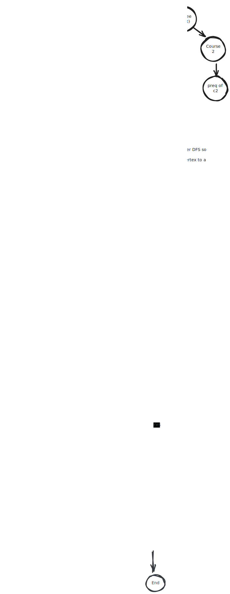

# 3020

Students:
* Jake Follest (0797420)
* Kara Wilson (0800561)

Github repo: https://github.com/Kara-Zor-El/COIS-3020

This is our 3020 assignment on university course scheduling. While the assignment wanted us to solve a rather simple topological sorting problem and ignore any timeSlot overlaps, we decided to try and solve the more general problem of scheduling with overlaps and `Fall` and `Winter` terms, this has the benefit of solving the original problem as the original problem is just our problem where there are timeSlots for every course in every term. The problem we chose to solve isn't an easy one in fact it's considered [NP-Hard](https://en.wikipedia.org/wiki/NP-hardness) that is to say there is no simple algorithm that can solve this in polynomial time. Instead two approaches are often used, either a simpler greedy algorithm or a constraint based approach both have their advantages and disadvantages.
The best way to get a truly optimal solution is to treat the problem as a constraint issue and represent the constraints as a series of linear equations, these equations can then be fed to a constraint solver and an optimal solution can be found, while this is guaranteed to find the optimal solution it could take quite a while as constraint solving isn't a simple thing and often uses fixed point iterations to converge towards a desired point. Some more information can be found in this paper [here](https://www.sciencedirect.com/science/article/abs/pii/S0360835221007592#s0090).
The secondary option is a greedy algorithm, which will place courses into the graph as early as possible following tuned weights and priorities, while this is guaranteed to solve the assignment problem it isn't guaranteed to give the most optimal solution to our problem as you may schedule a course with an overlapping timeSlot with a more optimal course. Backtracking can be used to help make this perform better however you are never guaranteed to find a solution without backtracking through every possible solution which obviously isn't practical.
We chose to use a hybrid approach where we use constraints as scheduling heuristics to drive a greedy scheduler. This isn't guaranteed to give the most optimal solution however algorithmically it will solve the course problem and give a rather optimal solution to the problem we decided to work on. The way this approach works is we compute a priority `cost` which is defined as the longest path from the degree root where prereqs are weighted higher than co-requisites. We then start by placing required courses (a required course is defined as any course on the path to our degree node), after we've placed required courses we place our filler courses (courses used to hit `C` that are not required), when placing courses we use the same logic for both required and filler courses, what we do is grab the course from our list with the highest `cost` and then do a [topological sort](https://www.geeksforgeeks.org/dsa/topological-sorting-indegree-based-solution/) to place courses from their leaf pre-requisite up the chain. We try to place the course in the earliest term possible however if we run into a hard constraint (There is no non overlapping timeslot, the course doesn't run this term, not all pre-reqs have been taken before this term or co-reqs have been taken before this term, the term is full) then we try to place it in the next term and so on. The topological sort guarantees that all co-requisite and pre-requisite courses are taken in prior and the constraint based approach targets optimal course placement. More constraints and tuning to cost can be easily added in the future to help optimize a course with sub bias's like preferring courses in the afternoon. When we place a course we check if there is any timeTable permutations that are valid, i.e we generate every permutation of course schedules for that term and if there is a valid one we place it, when emitting the schedule we just take the first permutation and call it a day however it would be easy for us to use some weights to rank these permutations and optimize the schedule for something like courses in the afternoon or morning. It may sound terribly inefficient to generate every permutation but when you consider that courses usually have far less than `10` sections and there are probably less than `6` courses in a term that's only `1,000,000` permutations, however we never really even hit that as we also get to narrow by term which means there are never really any terms that have more than 5 sections on regular input data which reduces our problem space, we also narrow the sections for any that overlap as we're adding which actually means that as we are adding our permutation count usually stays the same. On our mock trent data we can schedule an entire cois major in less than 10ms. 




- [3020](#3020)
  - [Commands](#commands)
    - [Running](#running)
    - [Default Experimenting](#default-experimenting)
    - [Building](#building)
    - [Formatting](#formatting)
    - [Testing](#testing)
  - [Dependencies](#dependencies)
    - [System](#system)
    - [cSharp](#csharp)
  - [Testing](#testing-1)

## Commands

Below are a list of commands / tasks you can run in order to work with the project

### Running

This command is used to run the project with custom the valid cli arguments.

With TaskFile:
```sh
task -- <cli_args>
```
Without TaskFile:
```sh
dotnet run --project A1 -- <cli_args>
```

### Default Experimenting

This command is used to quickly experiment in debug mode.

With TaskFile:
```sh
task experiment
```
Without TaskFile:
```sh
dotnet run --project A1 -- ./courseData.json -o ./schedule.md --degree COIS --credit_count=40 --term_size=5 --log --graph_output ./courseGraph.md --debug
```

### Building

This command will simply build the project.

With TaskFile:
```sh
task build
```
Without TaskFile:
```sh
dotnet build A1
```

### Formatting

This command will simply format the project.

With TaskFile:
```sh
task format
```
Without TaskFile:
```sh
dotnet format A1
dotnet format A1Tests
```

### Testing

This command will run the test suite and validate the project.

With TaskFile:
```sh
task test
```
Without TaskFile:
```sh
dotnet test A1Tests
```

## Dependencies

These are list of external utilities that we decided to use mostly for convenience and to the user's benefit. The project wasn't about making a cli or fancy printing but we still wanted a nice user experience. 

### System

* [dotnet](https://dotnet.microsoft.com/en-us/) (required)
  * This is required to build and run any cSharp project.
* [TaskFile](https://taskfile.dev/) (optional, recommended)
  * This is a simple task running system, we recommend it's installation to make your life easier however the project can be built like any other cSharp project using the command directly from the `./Taskfile.yml` rather than using the task system.
* [Nix](https://nixos.org/) (optional)
  * Nix isn't required, it is used to run our test suite with consistent dependencies defined in `flake.lock`, you can check the tooling we define in there and install it locally however all tooling is also documented here.

### cSharp

* [`SpectreConsole`](https://spectreconsole.net/console)
  * This dependency is only used to output nice schedule tables to the console.
  * Important: This is not used at all in our core scheduling algorithm.
* [`SpectreConsole.Cli`](https://spectreconsole.net/cli)
  * This dependency is only used to provide a nice user facing cli with proper argument parsing and colored cross platform messages.
* [`Verify`](https://github.com/VerifyTests/Verify)
  * This dependency is used for proper snapshot testing in our testSuite.
  * Important: This is not used at all in our core scheduling algorithm.

## Testing

Our testing is implemented in `A1Tests` using `MSTests`. We use a combination of both `Assert` tests and `Snapshot` tests depending on what we are targetting.

The goal of `Assert` tests are to test individual behavior on an api element. For instance we want to manually check that the number of vertices in a graph did in fact increase by 1 when we add a vertex. 

The goal of `Snapshot` tests is to capture larger output that doesn't really make sense to check by hand, the downside to snapshot tests is you have to understand what the snapshots mean and just because the test pass's doesn't mean the snapshot is valid hence when generating snapshots it's important to keep a close eye on what the actual values are.

We run our test suite on every commit to our github repo through github actions in order to make sure that we are pushing good code to main.

Copyright ©️ 2026 Jake Follest, Kara Wilson