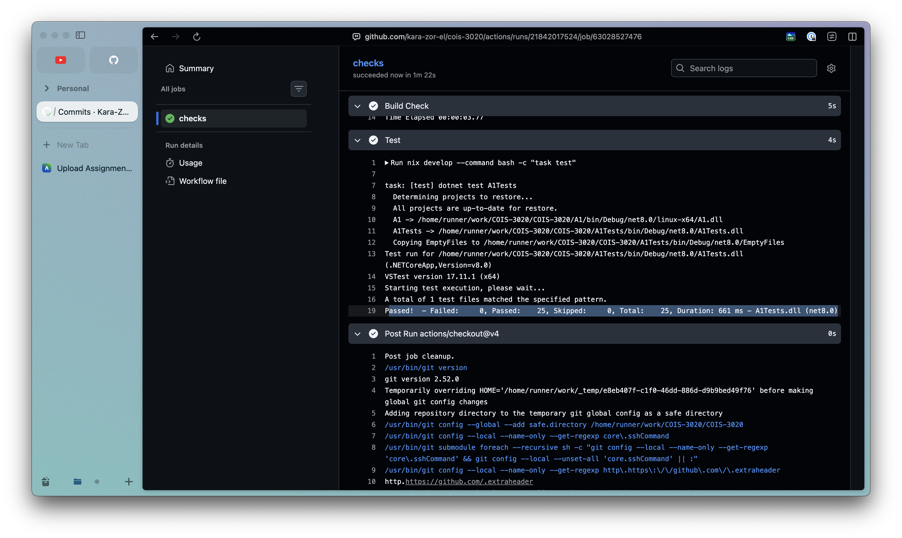

# Testing

As we did our testing using a proper test framework we don't have a traditional pdf to submit.

A report that our tests pass can be found here: https://github.com/Kara-Zor-El/COIS-3020/actions/runs/21842017524/job/63028527476

Our tests for PartA can be found in `./A1Tests/PartA.cs` the expected outputs are defined by the `Assert` functions.

Our tests for PartB can be found in `./A1Tests/PartB.cs` and the expected outputs are defined in `Snapshots`.

`task experiment` or `dotnet run --project A1 -- ./courseData.json -o ./schedule.md --degree COIS --credit_count=40 --term_size=5 --log` can also be run to see the output on the `courseGraph.json` which is a test against a dataSet similar to Trents course graph.